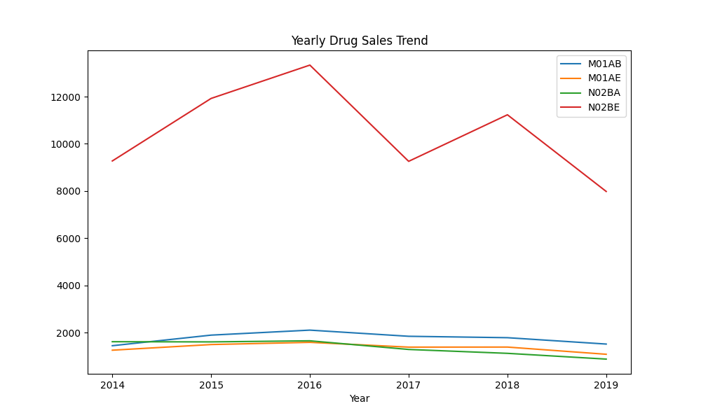
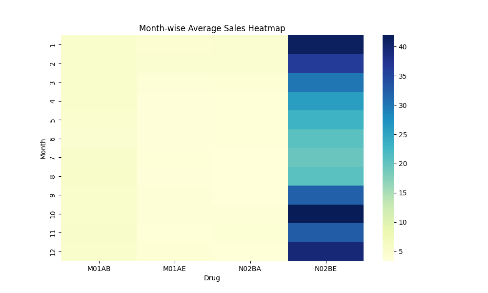
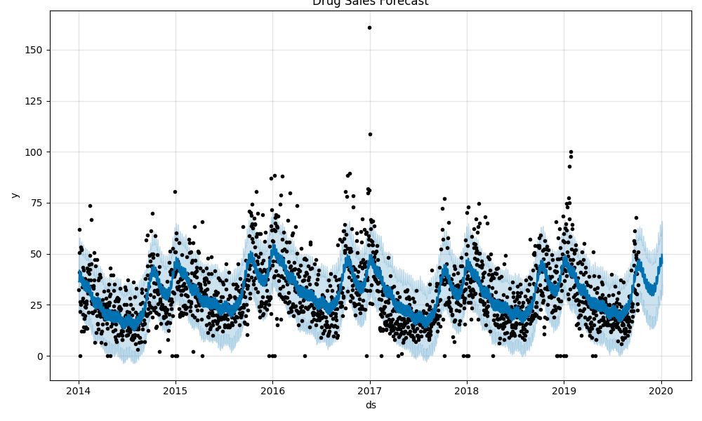

Pharma Sales Analytics & Business Intelligence Dashboard
1. Executive Summary

This project presents an end-to-end analysis of pharmaceutical sales data to uncover revenue drivers, demand patterns, seasonal effects, and revenue concentration across drug categories.

The objective was to convert raw transactional data into structured business insights that support inventory optimization, revenue forecasting, and strategic product prioritization.

The project integrates Python-based exploratory analysis, SQL-driven KPI extraction, and Power BI dashboard visualization to create a complete analytical workflow.

2. Business Context

Pharmaceutical companies operate in demand-sensitive environments where accurate forecasting and inventory planning directly impact profitability.

Key challenges addressed in this project:

Revenue concentration across limited product categories

Seasonal demand fluctuations

Monthly sales volatility

Inventory misallocation risks

Lack of predictive visibility

3. Objectives

Analyze overall sales growth trends

Identify high-performing drug categories

Detect seasonal patterns

Study revenue concentration

Evaluate monthly variability

Build a sales forecasting model

Develop an executive dashboard

4. Dataset & Preprocessing

The dataset includes:

Drug category

Sales date

Monthly revenue

Yearly performance

Sales metrics

Preprocessing steps:

Missing value handling

Date formatting & feature extraction

Aggregation by month and year

KPI computation

Category-level revenue breakdown

5. Analytical Findings & Visual Insights
5.1 Overall Revenue Growth Trend

Insights:

Consistent upward revenue trend

Strong mid-year spikes

Indicates stable and growing market demand

5.2 Revenue Concentration (Top Categories)

Insights:

Limited categories generate majority revenue

Revenue follows Pareto-like distribution

Strategic focus on top SKUs can increase profitability

5.3 Monthly Seasonal Heatmap

Insights:

Predictable seasonal peaks

Certain months consistently outperform

Supports proactive inventory planning

5.4 Monthly Sales Distribution (Volatility Analysis)

Insights:

Reveals sales spread across months

Identifies outliers and revenue variability

Useful for risk-based demand planning

5.5 Category-Wise Performance Trend

Insights:

Compares growth trajectory of major drug categories

Identifies stable vs fluctuating categories

Enables product-level strategic decisions

5.6 Cumulative Revenue Growth

Insights:

Demonstrates long-term compounding revenue

Shows acceleration pattern

Useful for performance evaluation

5.7 Sales Forecast Projection

Insights:

Predicts steady growth trend

Assists quarterly demand planning

Reduces stock-out and overstock risks

6. Business Recommendations

Based on analysis:

Prioritize high-revenue categories

Implement seasonal inventory allocation

Use forecast outputs for quarterly planning

Review underperforming categories

Integrate predictive models into operations

7. Dashboard Features

The Power BI dashboard includes:

Revenue KPIs

Category-level comparison

Monthly trend visualization

Seasonal heatmaps

Forecast analysis

Interactive filters and slicers

8. End-to-End Workflow

Data Cleaning

Feature Engineering

Exploratory Data Analysis

KPI Derivation

Visualization

Forecast Modeling

Dashboard Reporting

9. Skills Demonstrated

Data Cleaning & Transformation

KPI Identification

Revenue Concentration Analysis

Seasonal Trend Analysis

Forecast Interpretation

Business Insight Generation

Dashboard Design

Data Storytelling

10. How to Run
pip install pandas numpy matplotlib seaborn scikit-learn

Run Jupyter notebooks

Open Power BI dashboard

Explore insights interactively
