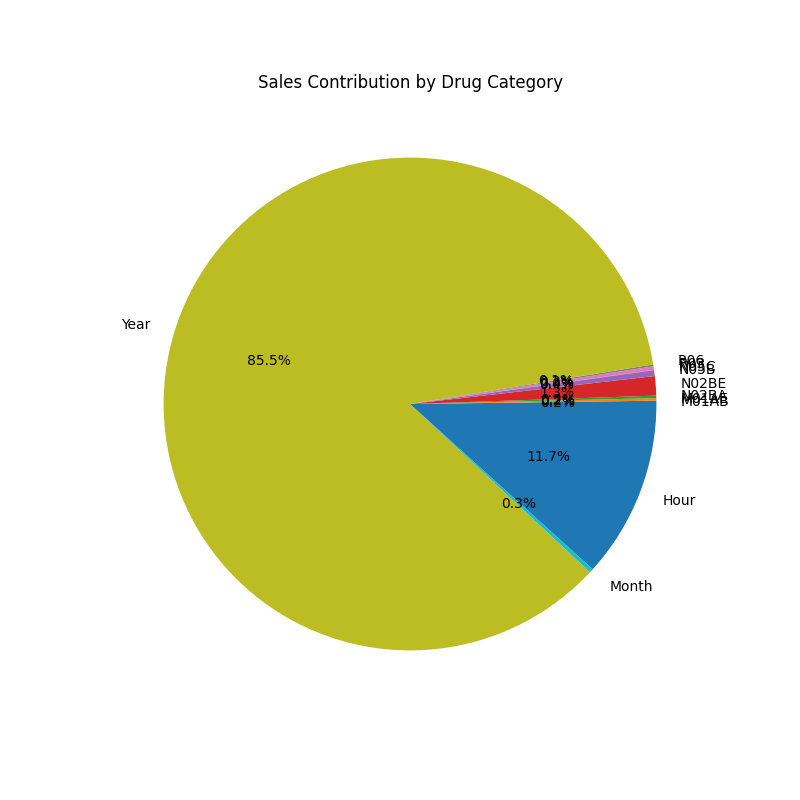
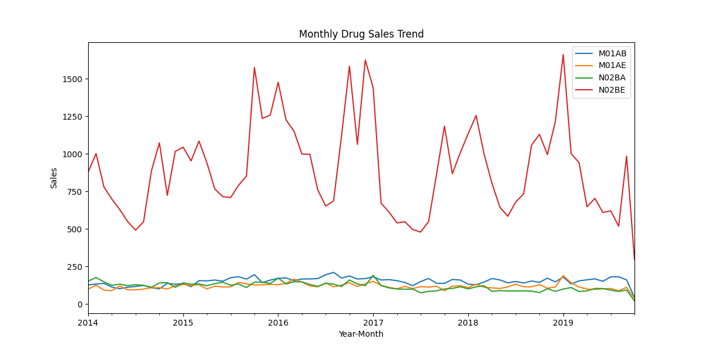

# Pharma Sales Analytics & Business Intelligence Case Study

#  1. Executive Overview

This project presents a comprehensive pharmaceutical sales analytics case study focused on identifying revenue drivers, understanding seasonal demand behavior, and forecasting future sales performance.

The objective is not only to visualize historical sales data but to transform transactional records into structured business intelligence capable of guiding:

- Revenue optimization strategies
- Inventory planning decisions
- Category-level prioritization
- Long-term forecasting and procurement planning

The project demonstrates an end-to-end analytics workflow integrating Python, SQL, Excel, and Power BI to support strategic decision-making in a pharmaceutical sales environment.

#  2. Business Context

Pharmaceutical companies operate in highly regulated and demand-sensitive markets. Small forecasting inaccuracies can lead to:

- Overstocking (increased holding costs)
- Stock-outs (lost sales and customer dissatisfaction)
- Expired inventory (direct financial loss)

Understanding revenue concentration, demand seasonality, and product-level performance is critical for:

- Working capital optimization
- Demand forecasting accuracy
- Strategic resource allocation
- Sustainable revenue growth

This analysis evaluates historical revenue behavior to derive structured, actionable business insights.

#  3. Dataset Overview

The dataset consists of transactional pharmaceutical sales records including:

- Drug Category
- Sales Date
- Revenue Amount
- Transactional Identifiers

Each record represents a sales transaction associated with a specific drug category and time period.

The dataset allows:

- Time-series analysis
- Category contribution evaluation
- Revenue concentration study
- Forecast modeling

#  4. Data Preparation & Feature Engineering

Before performing analysis, the dataset underwent structured preprocessing:

###  Data Cleaning
- Handled missing or inconsistent entries
- Standardized date formats
- Removed invalid transactions (if applicable)

### Feature Engineering
- Extracted Year from transaction date
- Extracted Month from transaction date
- Aggregated revenue at:
  - Monthly level
  - Yearly level
  - Category level

This transformation enabled deeper temporal analysis and trend evaluation.

Proper preprocessing ensures analytical accuracy and model reliability.

#  5. Revenue & Trend Analysis

##  5.1 Overall Revenue Growth Trend

### Analysis:

The yearly revenue trend demonstrates a consistent upward trajectory across time periods.

Key observations:

- Revenue exhibits sustained long-term growth.
- No structural revenue collapse or stagnation detected.
- Growth stability suggests expanding market demand.

### Business Interpretation:

This pattern indicates healthy market positioning and stable product portfolio performance. The company appears to be scaling effectively.

From a strategic perspective:
- Investment expansion may be justified.
- Production planning can be scaled gradually.
- Growth momentum supports market confidence.

## 5.2 Revenue Concentration by Drug Category

### Analysis:

A small subset of drug categories contributes disproportionately to total revenue.

This distribution follows a Pareto-like pattern:
- ~20% of categories generate the majority of revenue.
- Remaining categories contribute marginally.

### Business Implication:

This insight enables:

- Focused marketing investment on high-performing categories
- Priority-based inventory management
- Strategic product positioning

High-contribution categories should be protected from stock-outs and prioritized in promotional planning.

##  5.3 Seasonal Demand Pattern

### Analysis:

The heatmap highlights recurring seasonal peaks and troughs.

- Certain months consistently outperform others.
- Demand patterns appear cyclical.
- Seasonal spikes may correlate with disease patterns or prescription cycles.

### Business Impact:

Seasonality enables proactive planning:

- Increase production before peak months.
- Optimize logistics scheduling.
- Avoid overproduction during low-demand periods.

Accurate seasonal awareness reduces inventory risk and improves operational efficiency.

## 5.4 Category Performance Over Time

### Analysis:

Tracking individual drug categories over time reveals:

- Some categories demonstrate stable growth.
- Others show volatility.
- Certain categories may show plateau or decline.

### Strategic Insight:

This supports:

- Product lifecycle management
- Identifying emerging vs mature products
- Rationalizing underperforming SKUs
- Diversification strategy decisions

Categories with sustained upward trends may warrant further R&D or marketing focus.

# 6. Sales Forecast Projection

### Forecast Model Overview:

A time-series forecasting model was developed based on historical sales trends.

The projection indicates:

- Continued revenue growth trajectory
- No abrupt structural decline predicted
- Stable seasonal components

### Business Application:

Forecasting supports:

- Quarterly revenue planning
- Procurement scheduling
- Working capital optimization
- Inventory planning alignment

Data-driven forecasting reduces uncertainty and improves strategic preparedness.

# 7. SQL-Based KPI Analysis

SQL was used to compute:

- Total Revenue
- Category-wise Contribution
- Monthly Revenue Aggregation
- Growth Rates
- Running Revenue Totals
- Top-Performing Categories

This demonstrates the ability to perform scalable business analytics directly at database level, enabling enterprise-ready reporting capability.

#  8. Power BI Dashboard Development

An interactive Power BI dashboard was created to present:

- Revenue trends
- Category contribution charts
- Seasonal heatmaps
- Growth analysis
- Forecast projections

The dashboard enables business users to:

- Filter by category
- Analyze time periods
- Monitor performance interactively

This bridges the gap between technical analysis and executive decision-making.

#  9. Strategic Business Insights

Based on comprehensive analysis:

1. Revenue growth is stable and sustainable.
2. Revenue concentration suggests focused category prioritization.
3. Seasonal patterns allow predictive inventory planning.
4. Forecast indicates continued upward trajectory.
5. Category-level trend differences require differentiated strategies.

#  10. Conclusion

This case study demonstrates core Data Analyst competencies:

1.  Revenue trend analysis  
2.  Concentration & Pareto analysis  
3.  Seasonality detection  
4.  Time-series forecasting  
5.  SQL KPI computation  
6.  Dashboard storytelling  
7.  Strategic business interpretation  

The project transforms raw pharmaceutical sales data into structured, decision-support intelligence.

It reflects the ability to combine technical analysis with business reasoning to support real-world strategic decisions.

